# 智能语音技术

# 3.1 语音处理的定义

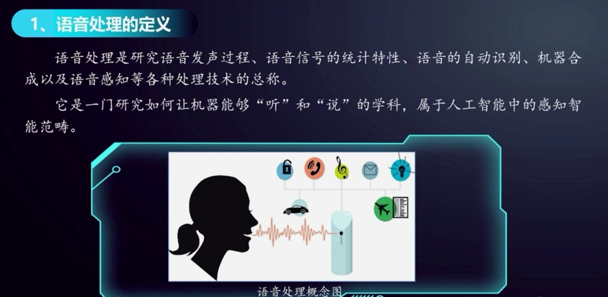

由于现在的语音处理基本上都是以数字计算机为基础，并借助微处理器、信号处理器、通用计算机加以处理，因此也称为数字语音信号处理。

# 3.2 语音处理技术与应用框架

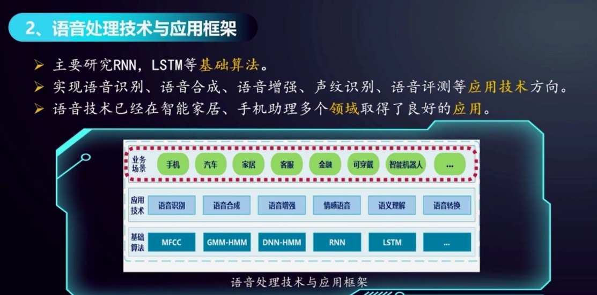

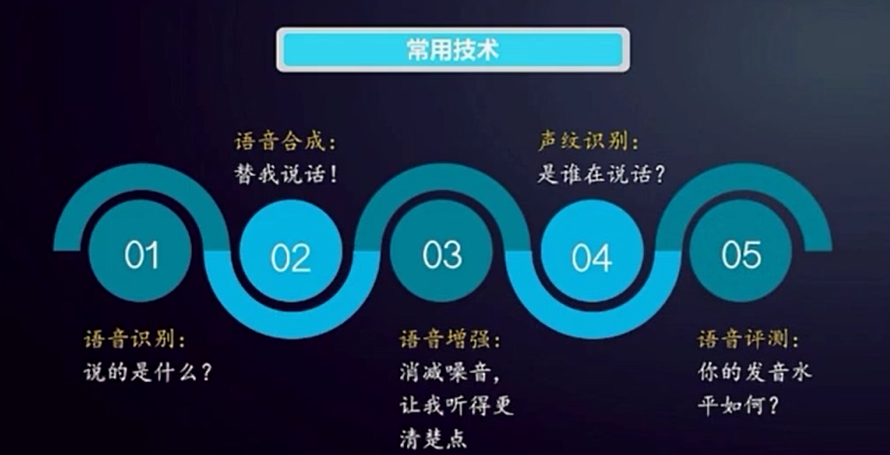

## 3.2.1 语音识别：**ASR 是 “耳朵”** （听语音转文字）

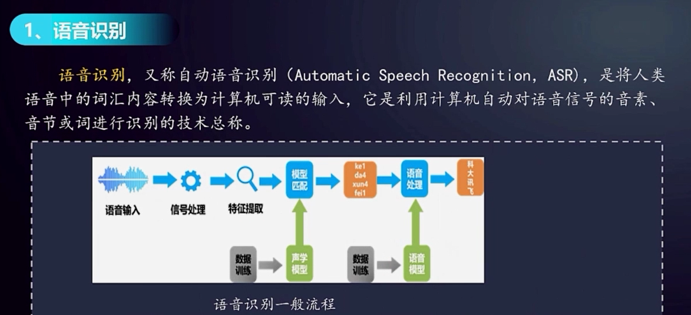

语音识别一般包括特征提取、建立声学模型、建立语音模型、解码搜索四个核心步骤。

从最初人的声音 --> ke da xun fei （声学模型的结果）--> 科大讯飞、可达熏费（语言模型的结果）--> 科大讯飞（解码搜索的结果）

理解：人是怎么一步步理解的，人工智能就是怎么一步步理解的，不要想的太复杂。

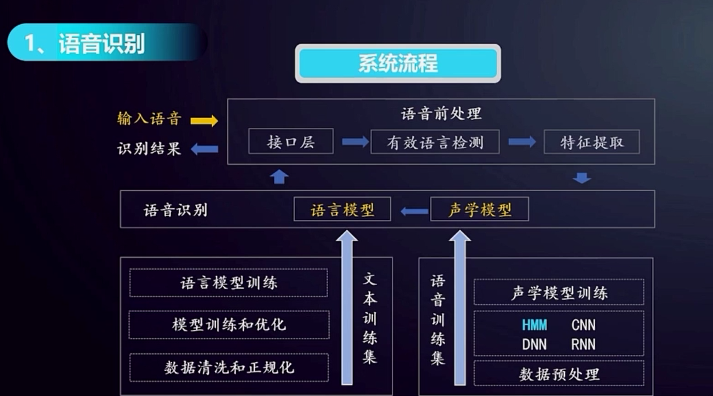

主流语音识别技术差别不大，输入语音的质量很重要，高质量的语音，识别的结果较好。

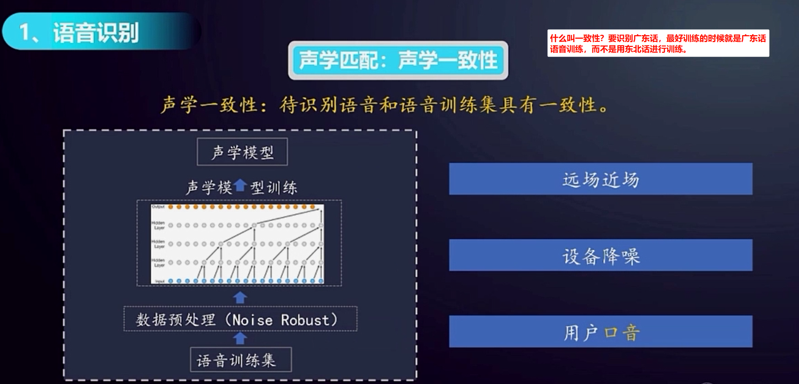

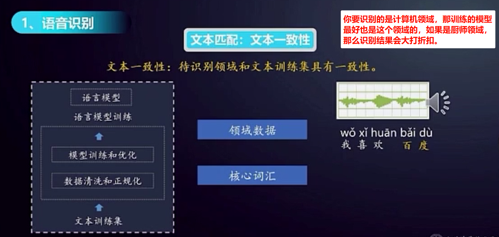

你以为听到的声音是我喜欢百度，是由于你的训练思维大多时候使用的是百度（核心词汇），但是结果其实应该是【我喜欢摆渡】，这就是领域数据和核心词汇的重要性。

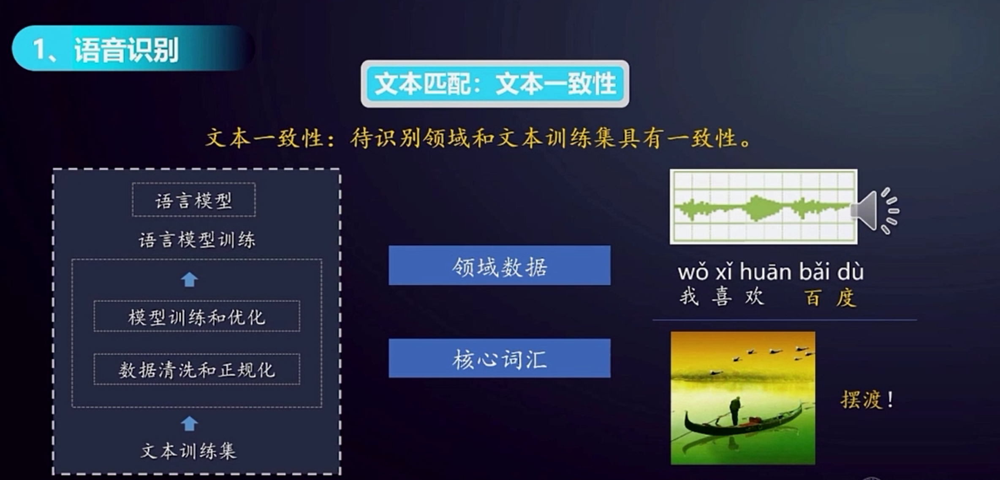

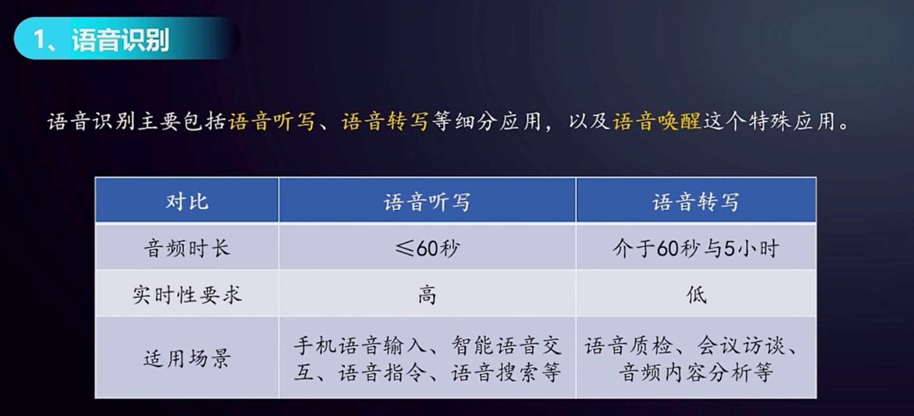

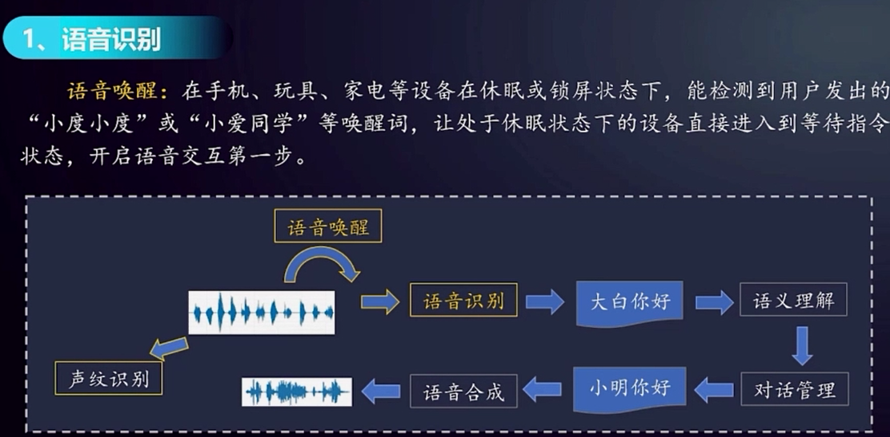

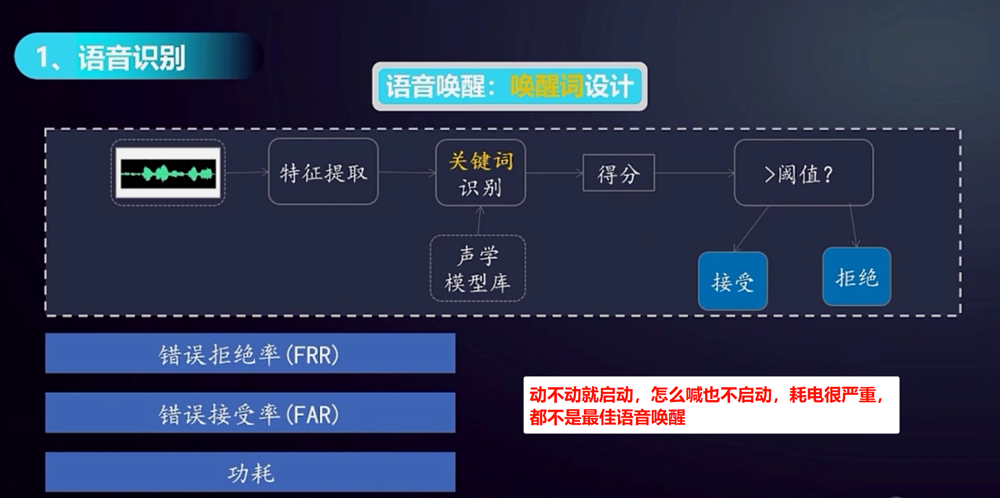

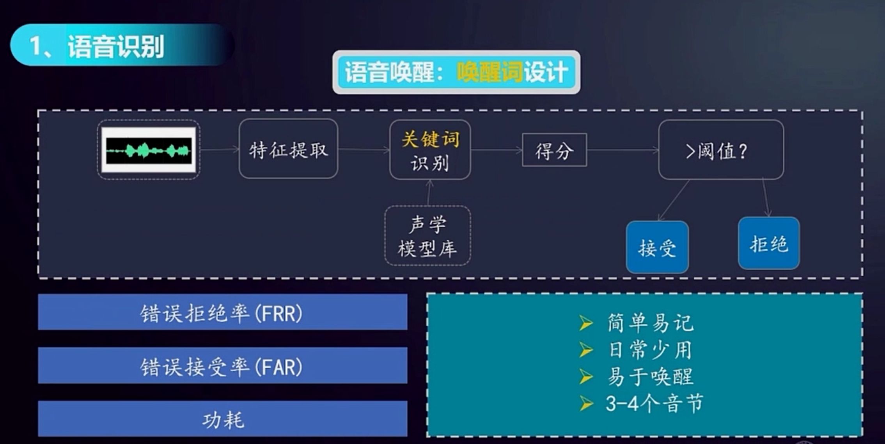

## 3.2.2 语音合成：**TTS 是 “嘴巴”** （将文字转语音）

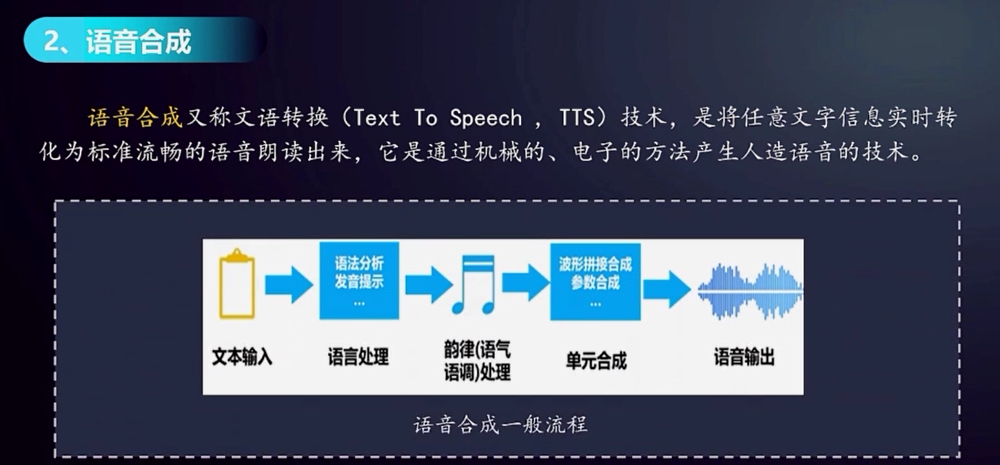

语音合成有三个关键环节：语言处理、韵律处理、单元合成。

语言处理：模拟人对自然语言的理解过程。包括文本规整、词的切分、语法分析和语义分析。目的就是让计算机理解文本是什么内容，文本写的是啥。

韵律处理：为合成语音规划出音段特征，设计出合理的发音，比如音高、音长、音强等。目标就是输出的声音听起来自然。

单元合成：根据语言处理、韵律处理两部分的输出结果合成最终声音。

TTS 是 “Text-to-Speech” 的缩写，中文译为**文本转语音技术**，是一种将文字信息自动转换为语音信号的人工智能技术。它的核心功能是让机器 “朗读” 文字，广泛应用于智能助手、语音导航、有声读物等场景。

## 3.2.3 语音增强

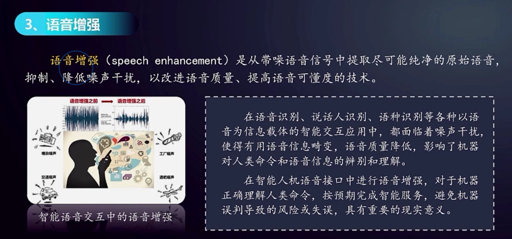

## 3.2.4 声纹识别

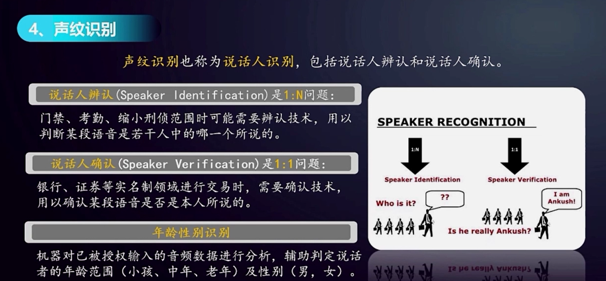

声纹辨认：识别 “你是谁”（从数据库中找出与你声纹匹配的身份，1:N 匹配）。

声纹确认：验证 “你是否是你声称的那个人”

## 3.2.5 语音评测

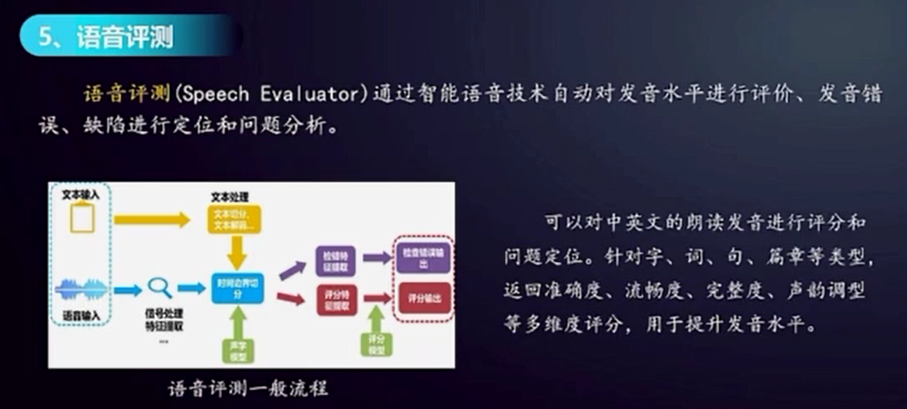

# 3.3 语音处理的常见应用

## 3.3.1 语音识别应用

1 社交聊天：社交聊天发送实时语音，支持中文，英文识别，方言支持广东语，四川话。让沟通交流更加准确。

2 游戏娱乐：语音聊天转文字，让用户在操作的同时也可看到聊天内容。

3 语音输入法：摆脱生僻字和拼音障碍，将所输入文字，直接用语音的方式输入，让输入法更加便捷。

4 语音搜索：搜索内容直接以语音的方式输入，让搜索更加高效

## 3.3.2 语音合成应用

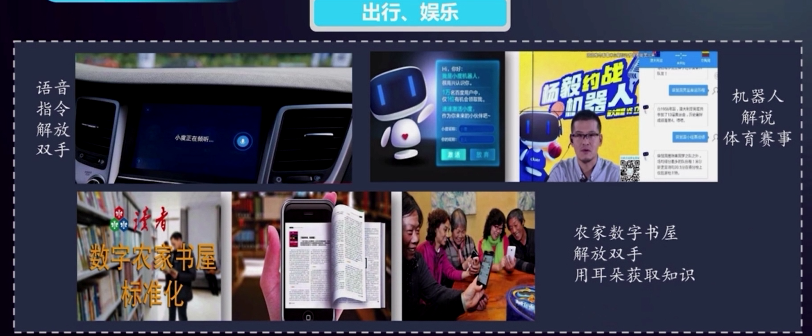

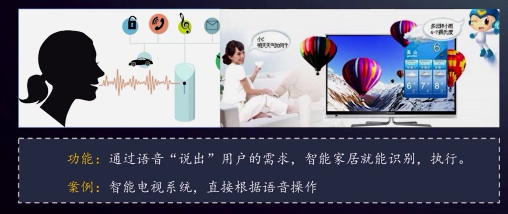

## 3.3.3 语音增强应用

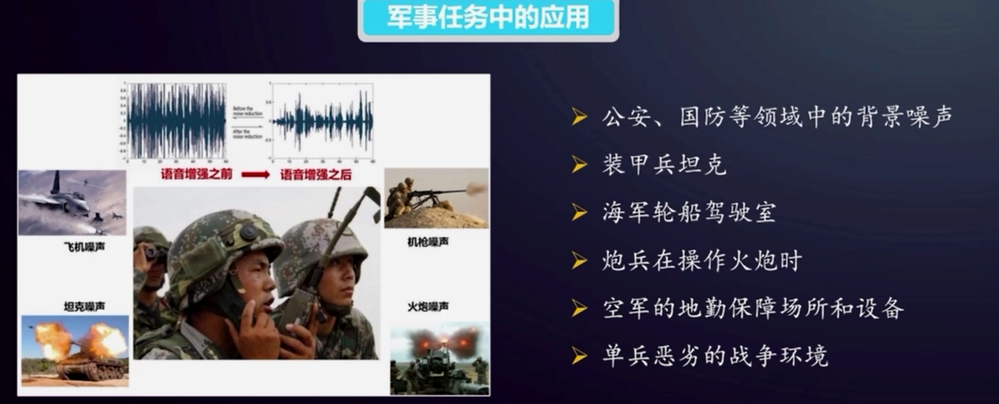

车载噪声、机载噪声、武器噪声等的抑制，对所关心的语音情报、语音命令、语音交流信息的增强，直接影响侦查情报、命令下达、机器识别的准确性、及时性和可靠性，直接影响着情报任务或战斗任务的效果，甚至成败。

## 3.3.4 声纹识别

思考：这个是声纹确认还是声纹辨认？

“小度小度，唱首歌” 的交互过程中，若设备开启声纹功能，其核心是验证当前用户是否为已授权的使用者（1:1 匹配），属于声纹确认。确认你是不是我的主人。

‍
